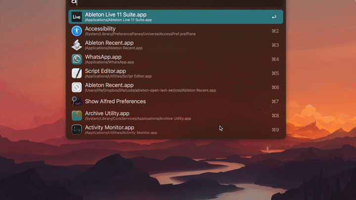

# Ableton Load Recent Set

Creates a way to launch Ableton with your most recent set automatically loaded. This is done by parsing Ableton's `Preferences.cfg` file to get the list of most recent sets (the same list you see in the `File -> Open Recent Set` dropdown) and then opening that file.

**Disclaimer**: This is functional but still very much a work in progress

## Dependencies
- python

## Demo

## Setup

OSX:
- Clone this repo or copy `get_recent_set.py` somewhere on your computer
- Launch the `Script Editor` app and create a new script with the contents inside of `osx/Ableton Recent.app`, replace `/path/to/get_recent_set.py` with the location you used for the previous step, hit save and set the `File Format` dropdown to `Application`
- Launch your spiffy new app and load directly into whatever you were last working on!

## TODOs
- support windows
- remove python dependency
- have applescript wait until project is loaded before giving application focus (currently focuses right when ableton loads)

## Notes
- The main motivation was to remove an additional step when trying to hop back into a project in order to reduce the number of distractions between the idea in your head and creating it. Saving time was not an objective (and it doesn't save much time - see the next note)
- When calling `open my_set.als` Ableton will *still* open to a blank Untitled.als project first and then open the project. Need to investigate if this is avoidable
